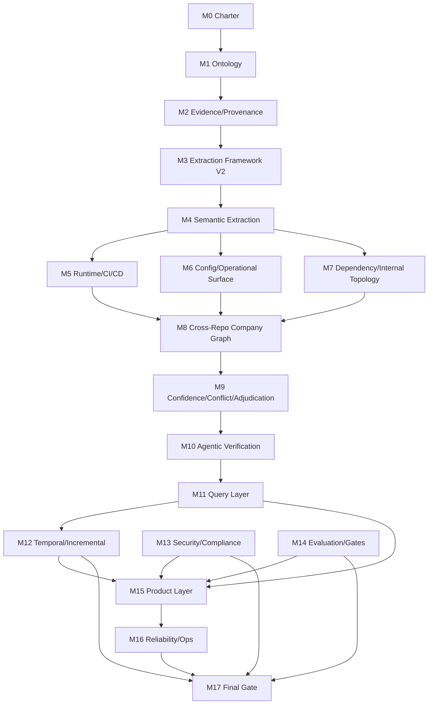

# DiffMind Roadmap - Dependency And Critical Path Map

## 1. Purpose

This document defines:

1. Milestone dependency graph for `M0-M17`.
2. Hard prerequisites that must be satisfied before starting downstream milestones.
3. Critical path that determines overall program completion.
4. Parallel tracks that can execute safely without lowering quality.

Use this document as the orchestration map for implementation agents.

## 2. Milestone Dependency Graph

## 3. Hard Prerequisite Matrix

| Milestone | Required Upstream Milestones | Reason |
|---|---|---|
| M1 | M0 | Cannot define schema without accepted question scope |
| M2 | M1 | Evidence/provenance must attach to canonical schema |
| M3 | M2 | Extractor SDK must emit traceable facts from day one |
| M4 | M3 | Semantic extractors require extractor framework contracts |
| M5 | M4 | Runtime/CI modeling depends on semantic extraction primitives |
| M6 | M4 | Config and surface mapping depends on semantic linking |
| M7 | M4 | Dependency mapping depends on semantic normalization layer |
| M8 | M5, M6, M7 | Company graph merge requires complete domain coverage |
| M9 | M8 | Confidence/conflict requires cross-repo integrated graph |
| M10 | M9 | Agentic verification must consume confidence/conflict queue |
| M11 | M10 | Query must expose verified and adjudicated truth classes |
| M12 | M11 | Temporal and incremental correctness depends on stable query semantics |
| M13 | M2, M11 | Security controls must protect evidence and query surfaces |
| M14 | M3, M4, M8, M11 | Evaluation requires mature extraction, graph, and query outputs |
| M15 | M11, M12, M13, M14 | Product layer must be query-first, secure, and quality-gated |
| M16 | M12, M15 | Reliability hardening must cover temporal graph and products |
| M17 | M13, M14, M16 | Final certification requires security, quality, and operations closure |

## 4. Critical Path

### 4.1 Primary Critical Path

1. `M0 -> M1 -> M2 -> M3 -> M4 -> M5 -> M8 -> M9 -> M10 -> M11 -> M12 -> M15 -> M16 -> M17`

This path is critical because it builds the core truth pipeline, verifier, query layer, temporal model, and production operation gates.

### 4.2 Why This Is Critical

1. Without `M2`, the graph cannot be explainable.
2. Without `M4`, extraction quality cannot reach enterprise precision.
3. Without `M8`, company-level graph composition is not possible.
4. Without `M10`, low-confidence ambiguity remains too high.
5. Without `M11`, no query-first value exists.
6. Without `M12`, no historical or change-impact intelligence exists.

## 5. Parallelizable Tracks

The following tracks can run in parallel after prerequisites are met:

1. `M5`, `M6`, and `M7` can run in parallel after `M4`.
2. `M13` can start after `M2` and mature alongside `M11`.
3. `M14` can begin framework setup after `M3`, then tighten at `M4`, `M8`, and `M11`.
4. Product prototypes for `M15` can begin in sandbox form after `M11` but cannot pass gate until `M12`, `M13`, `M14`.

## 6. Milestone Entry And Exit Dependency Gates

## M0
Entry gate: none.
Exit dependency gate: question catalog and KPI contracts frozen.

## M1
Entry gate: M0 exit gate complete.
Exit dependency gate: ontology and schema versioning approved.

## M2
Entry gate: M1 exit gate complete.
Exit dependency gate: provenance chain validated end-to-end.

## M3
Entry gate: M2 exit gate complete.
Exit dependency gate: extractor SDK and module registry stable.

## M4
Entry gate: M3 exit gate complete.
Exit dependency gate: semantic extraction meets initial quality floor.

## M5
Entry gate: M4 exit gate complete.
Exit dependency gate: runtime/build/deploy entities linked to services.

## M6
Entry gate: M4 exit gate complete.
Exit dependency gate: config lineage and operational surface graph stable.

## M7
Entry gate: M4 exit gate complete.
Exit dependency gate: dependency graph and ownership attachment stable.

## M8
Entry gate: M5, M6, M7 exit gates complete.
Exit dependency gate: cross-repo canonicalization and merge quality accepted.

## M9
Entry gate: M8 exit gate complete.
Exit dependency gate: confidence and contradiction services available to downstream.

## M10
Entry gate: M9 exit gate complete.
Exit dependency gate: verifier writes verified/disputed facts with strict evidence.

## M11
Entry gate: M10 exit gate complete.
Exit dependency gate: query and explain APIs cover core enterprise questions.

## M12
Entry gate: M11 exit gate complete.
Exit dependency gate: temporal and incremental correctness parity accepted.

## M13
Entry gate: M2 evidence model and M11 query contract available.
Exit dependency gate: policy and audit controls enforceable across APIs.

## M14
Entry gate: M3 framework available.
Exit dependency gate: quality gates are active and blocking in CI/CD.

## M15
Entry gate: M11, M12, M13, M14 complete.
Exit dependency gate: product APIs consume query contracts only.

## M16
Entry gate: M12 and M15 complete.
Exit dependency gate: reliability and rollback runbooks validated.

## M17
Entry gate: M13, M14, M16 complete.
Exit dependency gate: all mandatory program gates closed.

## 7. Risk Concentration Nodes

These milestones are high-impact blockers and must have dedicated risk management:

1. M4: semantic extraction quality bottleneck.
2. M8: cross-repo identity resolution bottleneck.
3. M10: verifier reliability and evidence discipline bottleneck.
4. M11: query correctness and explainability bottleneck.
5. M13: enterprise adoption blocker if delayed.
6. M14: release safety blocker if weak.

## 8. Recommended Agent Orchestration Strategy

1. Keep one coordinating agent on critical path tracking only.
2. Run domain agents in parallel for `M5`, `M6`, `M7`.
3. Run platform agents in parallel for `M13` and `M14` once prerequisites are met.
4. Require strict merge checks from KPI targets document before moving critical path milestones.

## 9. No-Go Conditions

Stop downstream work and rollback to prior milestone if any condition occurs:

1. Traceability coverage drops below required global gate.
2. Explain mode coverage drops below required global gate.
3. Cross-repo resolver regression creates unbounded contradiction growth.
4. Query correctness regresses below agreed threshold for critical question catalog.
5. Security policy checks fail on protected data access paths.
