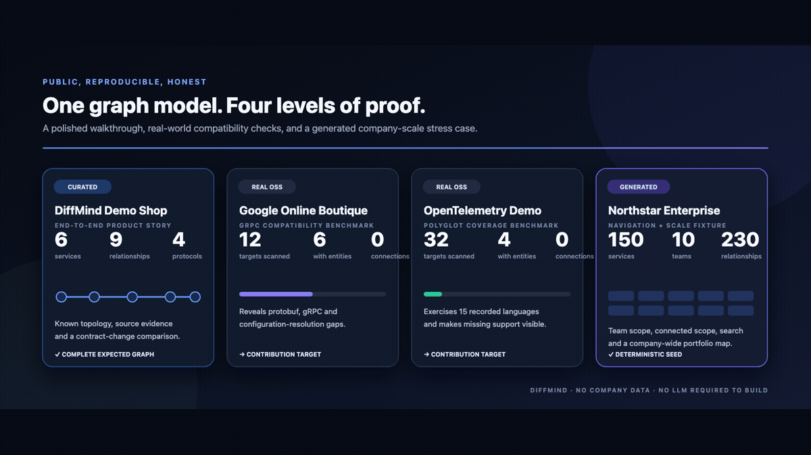
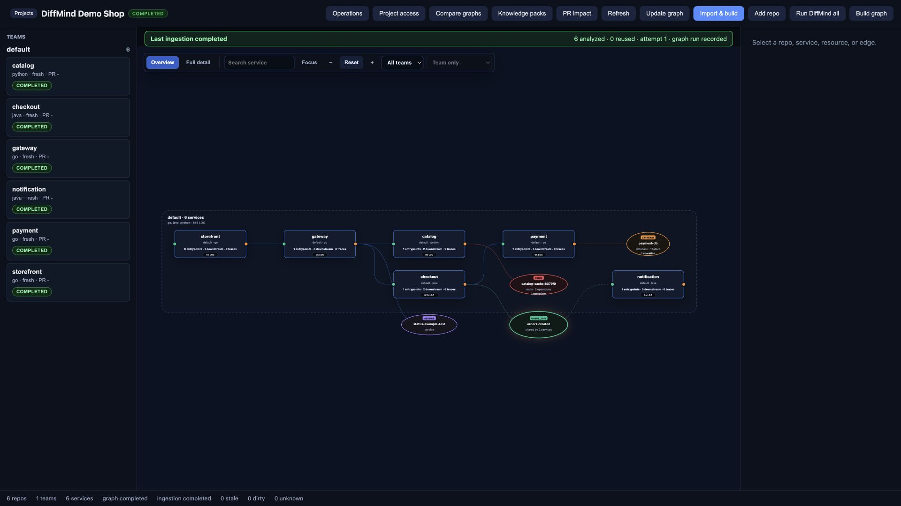
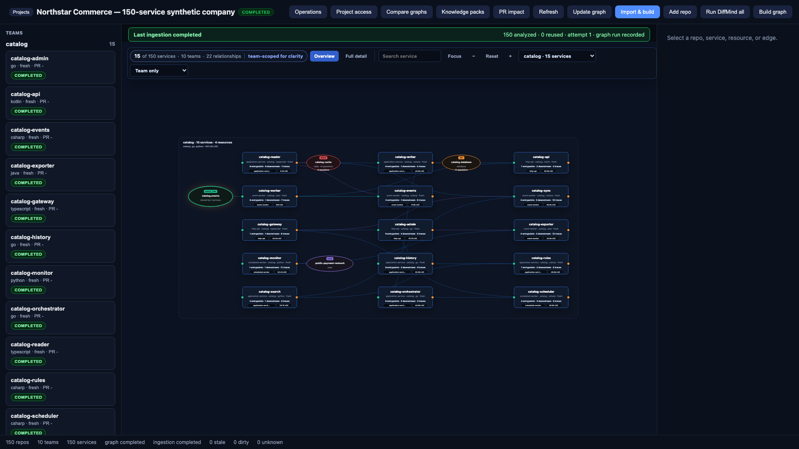
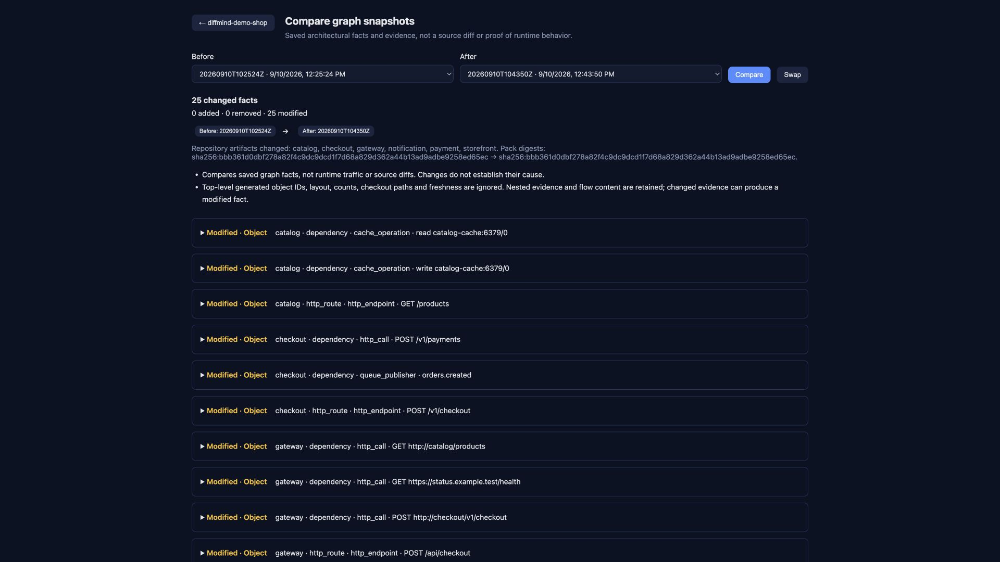
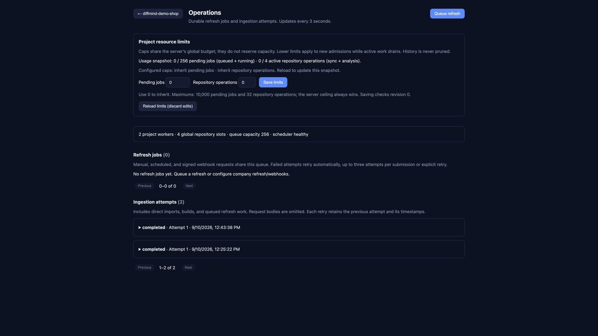
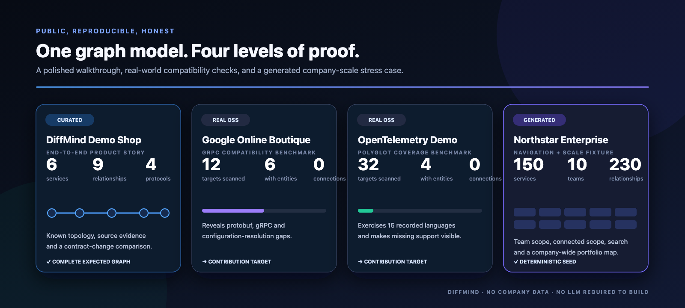

# Public demo and media

This is the canonical public story for DiffMind. It uses only synthetic
repositories and pinned Apache-2.0 upstream projects. No company source,
service name, hostname, credential or workspace is needed.



## The story in one minute

Demo Shop is six small Git repositories written in Go, Python and Java:

```text
storefront -> gateway -> catalog -> [catalog-cache]
                     \-> checkout -> payment -> [payment-db]
                                  \-> [orders.created] -> notification
```

DiffMind analyzes each repository, resolves cross-service identities and builds
one graph containing:

| Result | Verified value |
| --- | ---: |
| Services | 6 |
| Graph edges | 9 |
| Direct service-to-service edges | 4 |
| Async chains | 1 |
| Shared infrastructure resources | 3 |
| Stale or dirty repositories | 0 |

The graph includes four kinds of evidence-backed relationships: HTTP calls,
Kafka publication/consumption, Redis operations and a database write. A
deliberate external call to `status.example.test` shows how an external service
appears without pretending it is owned by the workspace.



## Demonstrate company scale without company data

The Northstar Enterprise fixture separates a scale demonstration from an
extraction-accuracy claim. It generates a deterministic workspace with 10
teams, 150 services, 30 resources and 230 relationships. Languages, file counts
and lines of code are generated metadata—not runtime telemetry and not claims
about real repositories.

```bash
make enterprise-showcase DEST=/tmp/diffmind-enterprise
DIFFMIND_HOME=/tmp/diffmind-enterprise \
  ./bin/diffmind ui --no-spa-rebuild
```

The graph does not attempt to show 150 readable labels at once. It starts with
one 15-service bounded context and visibly reports `15 of 150 services`. From
there a user can:

1. switch between all ten teams;
2. expand to **Team + connected** for immediate cross-team dependencies;
3. search for a service and focus its direct relationships;
4. select **All teams** for the company portfolio map.



The generator is tested, refuses non-empty destinations and accepts an explicit
seed. See the [scale-fixture guide](../examples/enterprise-showcase/README.md).

## Reproduce it from a clean checkout

Build DiffMind and generate the six independent repositories:

```bash
make build
sh scripts/prepare-showcase.sh /tmp/diffmind-demo-shop
```

Run the automated public fixture check:

```bash
make test-showcase
```

Start a workspace that contains no private data:

```bash
DIFFMIND_HOME=/tmp/diffmind-demo-shop/workspace \
  ./bin/diffmind ui --no-spa-rebuild
```

Open `http://127.0.0.1:8090`, create a project and choose **Import & build**.
Import `/tmp/diffmind-demo-shop/repositories`. A successful run should match
[`examples/demo-shop/expected.json`](../examples/demo-shop/expected.json).

## Demonstrate change impact

The prepared task evolves `POST /v1/checkout`:

> Add optional `deliveryWindow` and required `market`, then rename required
> `postalCode` to `deliveryPostalCode`.

Apply the scenario after preserving the baseline graph:

```bash
sh scripts/apply-demo-shop-change.sh /tmp/diffmind-demo-shop
```

Choose **Update graph**, then compare the saved runs. The request-contract query
produces four useful decisions:

| Field change | DiffMind classification | Reason |
| --- | --- | --- |
| Add required `deliveryPostalCode` | Potentially breaking | New required input; one half of the rename |
| Add optional `deliveryWindow` | Compatible | Existing callers can omit it |
| Add required `market` | Potentially breaking | Existing callers do not send it |
| Remove `postalCode` | Potentially breaking | Existing callers may still send the old key |

The generic graph comparison deliberately reports changed saved facts rather
than claiming causality. Runtime tests and an API migration policy remain the
final authority.



## Operate it over time

Runs are durable. The Operations screen records ingestion attempts, refresh
jobs, retries and resource limits, while repository and graph views report
freshness. This matters for agent use: a relationship from an old or dirty
analysis should not be treated as current truth.



## Give the graph to an agent

After following [`AGENT_SETUP.md`](../AGENT_SETUP.md), a coding agent can use the
same workspace to:

1. list services and inspect an endpoint or dependency;
2. trace callers before editing a contract;
3. retrieve source locations and confidence instead of inventing an edge;
4. compare request fields across saved runs;
5. report stale, dirty, unresolved or unsupported areas explicitly;
6. propose a tested knowledge-pack or detector contribution for a missing
   company convention.

A useful prompt for Demo Shop is:

> Use DiffMind to inspect `POST /v1/checkout`. Show its inbound caller,
> downstream payment call and published event with source evidence. Compare the
> two saved runs, classify the request-field changes, and state any uncertainty.

## Why there are four public examples

| Example | Purpose | Expected result |
| --- | --- | --- |
| Demo Shop | Stable product walkthrough and media source | Complete known topology and contract story |
| OpenTelemetry Demo | Broad polyglot compatibility benchmark | Finds detector gaps across many languages and frameworks |
| Google Online Boutique | Familiar gRPC-focused benchmark | Exposes protobuf, gRPC and configuration-resolution gaps |
| Northstar Enterprise | Deterministic navigation and scale fixture | Proves team scoping, search and layout with 150 services |

The real-world projects are intentionally not used as polished proof that every
framework is supported. At the pinned revisions, all 44 `src/*` scans and both
whole-monorepo scans completed, but many relationships were not resolved. The
generated enterprise fixture is intentionally not used as detector evidence.
See [the benchmark record](../examples/public-benchmarks/README.md) for exact
revisions, counts and the prioritized contribution areas.



## Media provenance and regeneration

The checked-in captures were produced on 10 September 2026 from the generated
Demo Shop and Northstar workspaces. They contain synthetic or public upstream
names only. Frames that exposed a private path were rejected rather than
redacted.

The animation is derived from these four captures:

- `public-proof.png` — the four-level public evidence summary;
- `demo-shop-graph.jpg` — complete six-service graph;
- `graph-comparison.jpg` — saved graph comparison;
- `enterprise-overview.png` — 15 readable services selected from 150.

After replacing the sanitized source captures, rebuild the GIF with:

```bash
make demo-media
```

Always regenerate from a fresh public-only workspace. Review every frame at full
resolution for usernames, absolute paths, private hostnames and credentials
before committing it.
